<div align="center">

# 🍄 Shroomie

### A friendly AUR package manager with a simple GUI


</div>

## 📖 Overview

Shroomie is a user-friendly AUR (Arch User Repository) package manager that provides a simple graphical interface to browse, install, and manage packages. Designed with simplicity and aesthetics in mind, it makes AUR package management more accessible.

> ⚠️ **Note:** This application is currently developed and tested in Hyprland environment. It has not been tested in other environments yet.

## 🌟 Features

<div align="center">
  <table>
    <tr>
      <td align="center"><b>🔍</b></td>
      <td><b>Smart Package Search</b> - Find packages with intelligent filtering</td>
    </tr>
    <tr>
      <td align="center"><b>⚡</b></td>
      <td><b>One-Click Installation</b> - Install packages with minimal effort</td>
    </tr>
    <tr>
      <td align="center"><b>🔄</b></td>
      <td><b>Update Management</b> - Keep packages up-to-date efficiently</td>
    </tr>
    <tr>
      <td align="center"><b>🎮</b></td>
      <td><b>Pixel-Art Interface</b> - Enjoy a nostalgic, user-friendly design</td>
    </tr>
    <tr>
      <td align="center"><b>🛠️</b></td>
      <td><b>Dependency Resolution</b> - Automatic handling of package dependencies</td>
    </tr>
  </table>
</div>

## 🔧 Installation

<div align="center">
  
</div>

### Prerequisites
- Arch Linux or Arch-based distribution
- Git
- Python 3.8+
- Base development packages (`base-devel`)

### Quick Install

```bash
# One-line installation
curl -sSL https://raw.githubusercontent.com/snow-arc/shroomie/main/install.sh | bash
```

### Manual Installation

1. **Clone the repository**
   ```bash
   git clone https://github.com/snow-arc/shroomie.git
   cd shroomie
   ```

2. **Run the installation script**
   ```bash
   chmod +x install.sh
   ./install.sh
   ```
   *This will automatically create and activate a virtual environment*

3. **Run the application**
   ```bash
   dist/main
   ```

### AUR Installation
```bash
yay -S shroomie-git
```

## 🏗️ Project Structure

<div align="center">



</div>

```mermaid
graph TD
    A[shroomie] --> B[components]
    A --> C[config]
    A --> D[models]
    A --> E[resources]
    A --> F[services]
    A --> G[ui]
    A --> H[utils]
    
    B --> B1[buttons]
    B --> B2[cards]
    B1 --> B1_1[nav_button.py]
    B1 --> B1_2[pixel_button.py]
    B2 --> B2_1[package_card.py]
    
    C --> C1[app_config.py]
    
    D --> D1[package.py]
    
    E --> E1[fonts]
    E1 --> E1_1[DotGothic16.ttf]
    E1 --> E1_2[PixelifySans.ttf]
    E1 --> E1_3[PressStart2P.ttf]
    
    F --> F1[aur_service.py]
    F --> F2[aur_storage.py]
    F --> F3[auth_manager.py]
    F --> F4[page_communicator.py]
    F --> F5[sudo_auth.py]
    
    G --> G1[dialogs]
    G --> G2[pages]
    G --> G3[main_window.py]
    G --> G4[sidebar.py]
    G1 --> G1_1[install_dialog.py]
    G1 --> G1_2[password_dialog.py]
    G2 --> G2_1[aur/]
    G2 --> G2_2[delete_page.py]
    G2 --> G2_3[dev_info_page.py]
    G2 --> G2_4[download_page.py]
    G2 --> G2_5[search_page.py]
    G2 --> G2_6[splash_page.py]
    
    H --> H1[themes]
    H --> H2[logger.py]
    H --> H3[styles.py]
    H --> H4[system_checks.py]
    H1 --> H1_1[colors.py]
    H1 --> H1_2[fonts.py]
    
    classDef default fill:#f9f9f9,stroke:#333,stroke-width:1px
    classDef main fill:#d0f0c0,stroke:#333,stroke-width:2px
    classDef module fill:#c6dcf9,stroke:#333,stroke-width:1px
    classDef file fill:#fff8dc,stroke:#333,stroke-width:1px
    
    class A main
    class B,C,D,E,F,G,H module
    class B1,B2,E1,G1,G2,H1 module
    class B1_1,B1_2,B2_1,C1,D1,E1_1,E1_2,E1_3,F1,F2,F3,F4,F5,G1_1,G1_2,G2_1,G2_2,G2_3,G2_4,G2_5,G2_6,G3,G4,H1_1,H1_2,H2,H3,H4 file
```

## 📷 Screenshots

<div align="center">
  <table>
    <tr>
      <td></td>
      <td></td>
    </tr>
    <tr>
      <td align="center"><i>Main Interface</i></td>
      <td align="center"><i>Package Search</i></td>
    </tr>
    <tr>
      <td></td>
      <td></td>
    </tr>
    <tr>
      <td align="center"><i>Package Installation</i></td>
      <td align="center"><i>Settings Screen</i></td>
    </tr>
  </table>
</div>

## 📊 Why Choose Shroomie?

<div align="center">
  <table>
    <tr>
      <th>Feature</th>
      <th>Shroomie</th>
      <th>Pamac</th>
      <th>Yay (CLI)</th>
    </tr>
    <tr>
      <td>GUI Interface</td>
      <td>✅</td>
      <td>✅</td>
      <td>❌</td>
    </tr>
    <tr>
      <td>Pixel Art Design</td>
      <td>✅</td>
      <td>❌</td>
      <td>❌</td>
    </tr>
    <tr>
      <td>Lightweight</td>
      <td>✅</td>
      <td>❌</td>
      <td>✅</td>
    </tr>
    <tr>
      <td>Fast Operations</td>
      <td>✅</td>
      <td>⚠️</td>
      <td>✅</td>
    </tr>
    <tr>
      <td>Dependency Visualization</td>
      <td>✅</td>
      <td>❌</td>
      <td>⚠️</td>
    </tr>
  </table>
</div>

## 🤝 Contributing

<div align="center">
  
</div>

Contributions are welcome! Here's how you can help:

1. **Fork the repository**
2. **Create your feature branch**: `git checkout -b feature/amazing-feature`
3. **Commit your changes**: `git commit -m 'Add some amazing feature'`
4. **Push to the branch**: `git push origin feature/amazing-feature`
5. **Open a Pull Request**

### Development Setup

```bash
# Create and activate virtual environment
python -m venv venv
source venv/bin/activate  # On Windows: venv\Scripts\activate

# Install development dependencies
pip install -r requirements-dev.txt

# Run the development version
python -m shroomie.main
```

### Code Style

We follow the PEP 8 style guide. Please run `black` and `flake8` before submitting:

```bash
black .
flake8
```


<div align="center">
  <p>Made with 🍄 by snow-arc</p>
  
  <a href="https://github.com/snow-arc">
    
  </a>
  
  <p>
    <a href="https://github.com/snow-arc/shroomie/issues">Report Bug</a>
    ·
    <a href="https://github.com/snow-arc/shroomie/issues">Request Feature</a>
  </p>
</div>
